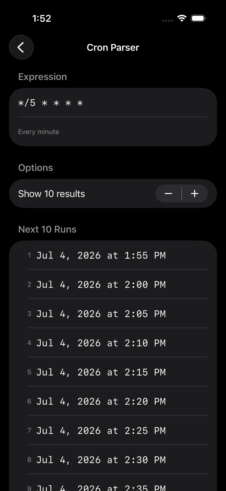
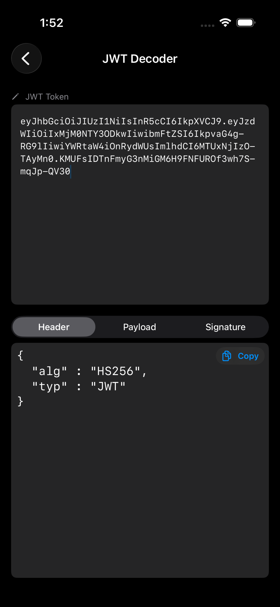
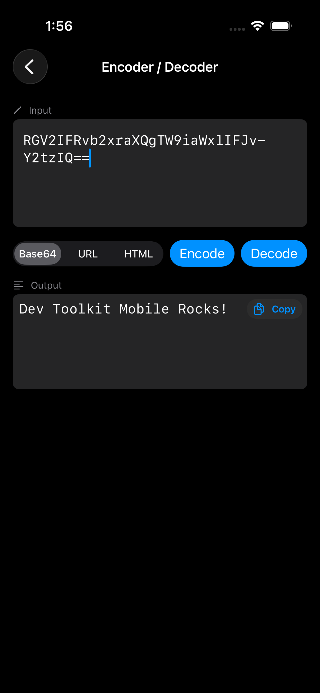
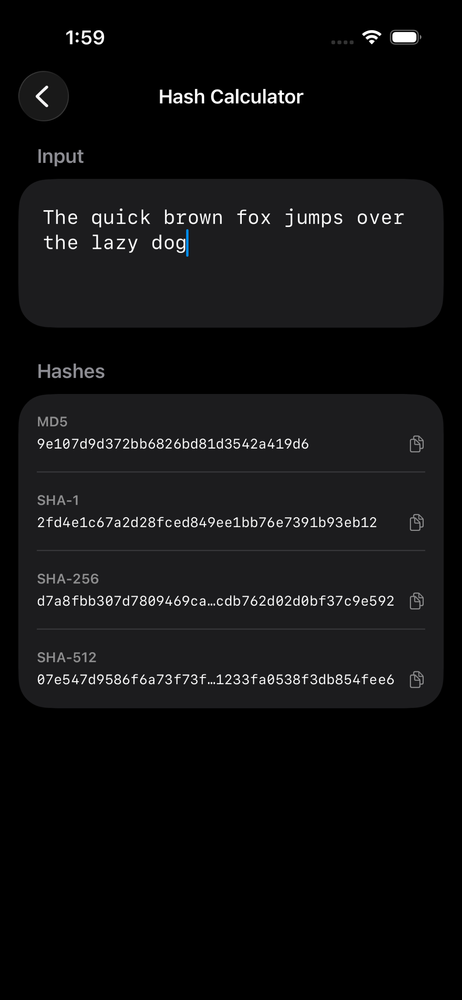
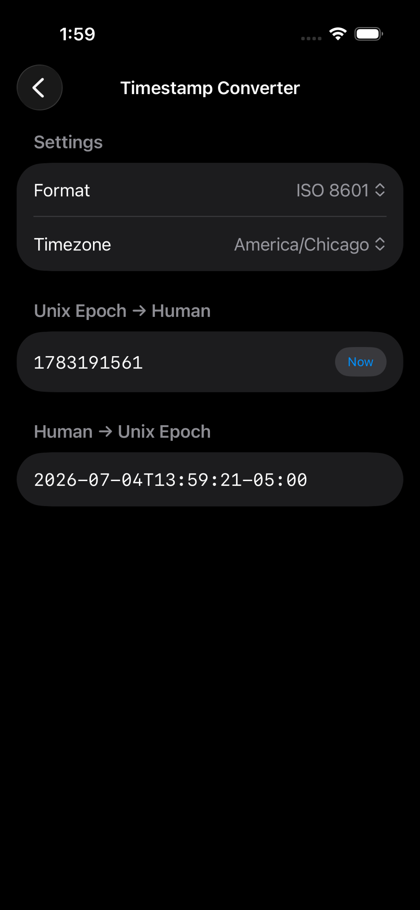
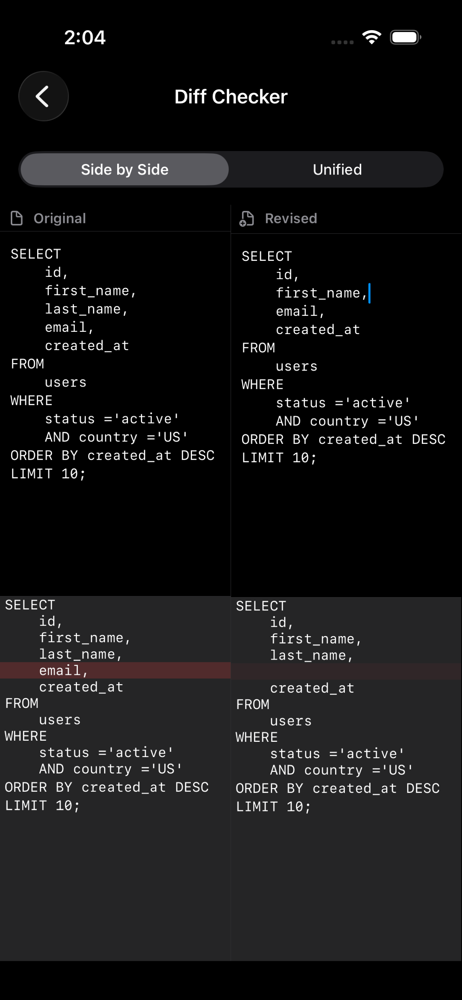

  

# Dev Toolkit

**The Swiss Army knife for developers.**
Everyday utilities — fast, native, offline.

---

## What's Inside

### Free Tools

| Tool                    | What it does                                                                       |
| ----------------------- | ---------------------------------------------------------------------------------- |
| **Cron Parser**         | Parse any cron expression and preview the next 5 scheduled runs in plain English   |
| **JWT Decoder**         | Decode JWT header, payload, and signature — expired tokens flagged automatically   |
| **Encoder / Decoder**   | Base64, URL-encode, and HTML-encode or decode any string                           |
| **Hash Calculator**     | Generate MD5, SHA-1, SHA-256, and SHA-512 hashes                                   |
| **Timestamp Converter** | Convert Unix epochs to readable dates and back, including seconds and milliseconds |

### Pro Tools

| Tool                 | What it does                                                                           |
| -------------------- | -------------------------------------------------------------------------------------- |
| **UUID Generator**   | Generate RFC 4122 v4 UUIDs in bulk with one-tap copy-all                               |
| **JSON Formatter**   | Pretty-print, minify, and validate JSON with syntax error highlighting                 |
| **Chmod Calculator** | Convert between octal permissions like `755` and symbolic permissions like `rwxr-xr-x` |
| **SQL Formatter**    | Clean up messy SQL with proper indentation and keyword capitalization                  |
| **Diff Checker**     | Compare two blocks of text side-by-side or as a unified diff                           |

---

## Screenshots

<!-- Replace with actual App Store screenshots -->

|                                          |                                                   |                                         |
| :--------------------------------------: | :-----------------------------------------------: | :-------------------------------------: |
|      |                |  |
|  |  |    |

---

## Why Dev Toolkit

* **Native SwiftUI** — No web views, no wrappers. Built for iOS 17+ from the ground up.
* **Offline-first** — Every tool works without an internet connection. Your data never leaves your device.
* **Adaptive layout** — NavigationStack on iPhone, NavigationSplitView on iPad.
* **One-tap copy** — Every output has a copy button. Generate, copy, paste. Done.
* **No accounts** — No sign-up, no cloud sync, no tracking.
* **Dark & light mode** — Full appearance support.
* **No subscriptions** — Pro is a one-time purchase. Pay once, own it forever.
* **Privacy-first** — Zero analytics. No data collection. Nothing phones home.

---

## Who It's For

Developers, sysadmins, DevOps engineers, and anyone who reaches for an online tool to decode a JWT, check a cron schedule, or hash a string.

Dev Toolkit puts those utilities in your pocket — offline, instant, and without 15 browser tabs.
